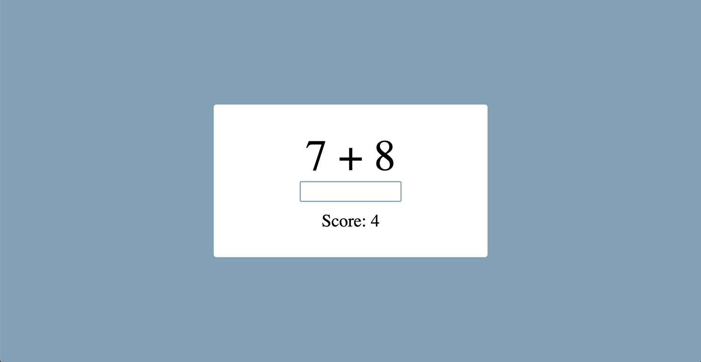

# Addition Game

This is a React project that is a project from [Harvard CS50 Web](https://cs50.harvard.edu/web/2020/).

## Table of contents

- [Overview](#overview)
  - [Screenshot](#screenshot)
  - [Game Logic](#game-logic)
  - [Links](#links)
- [My process](#my-process)
  - [Built with](#built-with)
  - [What I learned](#what-i-learned)
- [Author](#author)

## Overview

### Screenshot

### Game Logic

- Answer the addition question by typing the correct number and pressing enter.
- If the answer is correct, the score increases by 1.
- If the answer is incorrect, the score decreases by 1.
- When participant gets 10 points:
  - The participant wins, and the game is over.
  - The participant has the option to start the game over.

### Links

- Live Site URL: [Live Site](https://chriskorsak.github.io/addition-game/)

## My process

### Built with

- HTML5
- CSS
- REACT JS

### What I learned

I learned the basic workflow of React JS in this project, including: file structure, components, and the useState hook. I also utilized the React framework by linking to React, ReactDOM, and Babel using `script` tags in the `head` element.

## Author

- Website - [Chris Korsak](https://www.chriskorsak.net)
